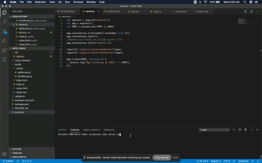

# Unit 11 Express Homework: Note Taker

## Description

This project was a homework assignment which uses express.js and api calls to connect a front end html site with backend data. Users can save, delete and create new notes which are saved to a json file in the backend.

## User Story

AS A user, I want to be able to write and save notes

I WANT to be able to delete notes I've written before

SO THAT I can organize my thoughts and keep track of tasks I need to complete

## Business Context

For users that need to keep track of a lot of information, it's easy to forget or be unable to recall something important. Being able to take persistent notes allows users to have written information available when needed.

## Demo

